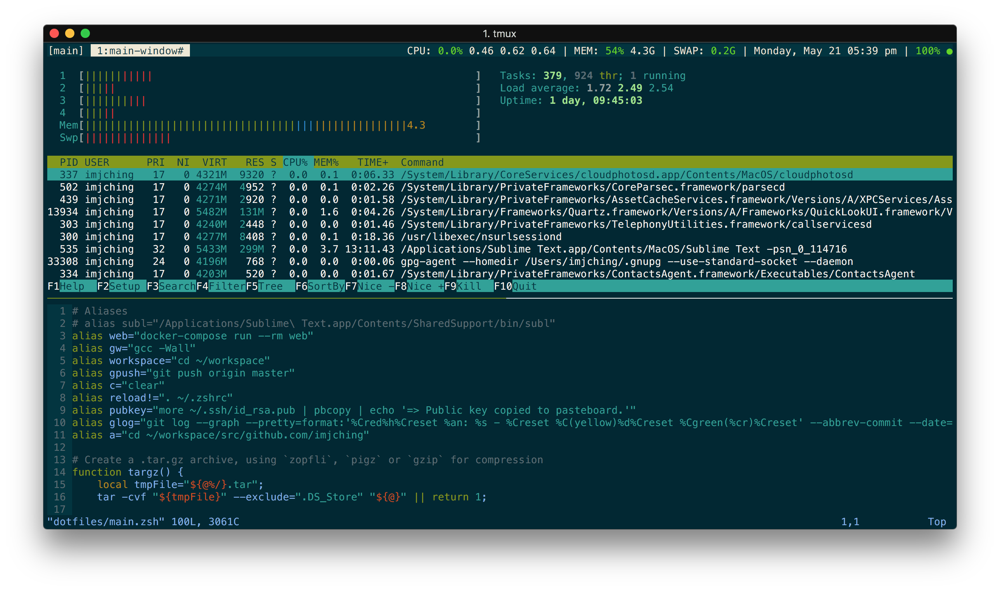

## dotfiles

### Setup

- **Terminal**: iTerm 2
- **Shell**: zsh
- **Editor**: vim / Sublime Text
- **Version control**: git / hg
- **Multiplexer**: tmux

### Usage

- Use `linker.sh` to symlink necessary files. It will prompt to override if the files already exist.
- Run `setup.sh` to set executable flags for bin files.
- `echo "source ~/dotfiles/main.zsh" >> ~/.zshrc`

### Screenshots

iTerm 2 with `tmux`

